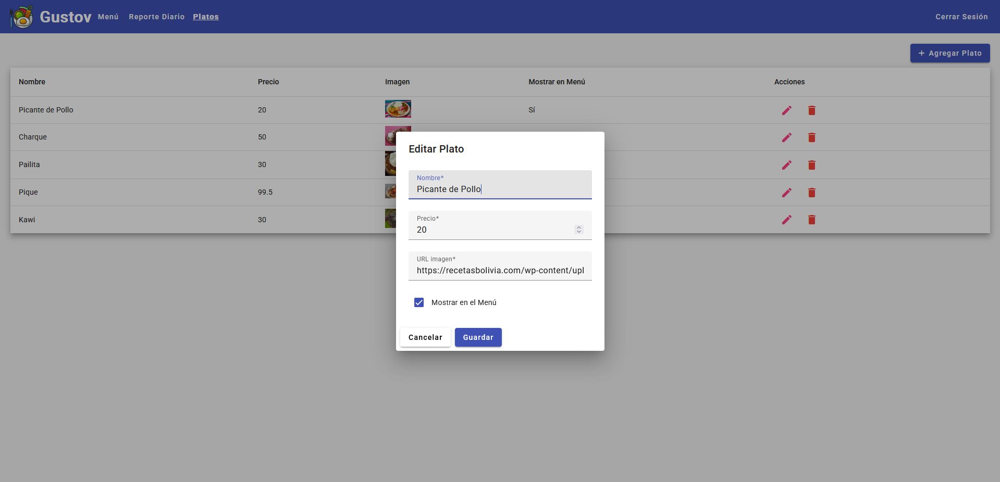

#  Gustov Restaurant - Frontend


## Descripción

Gustov Restaurant es una aplicación de frontend desarrollada en Angular para la gestión y visualización del menú, ventas, administración de platos y reporte diario de un restaurante.

## Características

- Visualización del menú
- Gestión de platos
- Realización de venta
- Autenticación de usuarios
- Reporte diario

## Capturas de Pantalla

### Página de Inicio de Sesión


### Menú


### Gestión de platos



### Venta


### ReporteDiario


## Instalación

Para instalar y ejecutar este proyecto localmente, sigue estos pasos:

1. Clona el repositorio:

   ```sh
   git clone https://github.com/tu-usuario/gustov-restaurant-frontend.git
   cd gustov-restaurant-frontend
   ```

2. Instala las dependencias:

   ```sh
   npm install
   ```

## Uso

### Desarrollo

Para ejecutar la aplicación en modo de desarrollo, usa el siguiente comando:

```sh
ng serve
```

Esto iniciará el servidor de desarrollo y abrirá la aplicación en `http://localhost:4200/`.

## Licencia

Este proyecto está licenciado bajo la Licencia MIT. Consulta el archivo `LICENSE` para más detalles.

---

_Desarrollado con ♥ por [Raquel](https://github.com/raquel-hash)_
